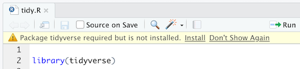

```{r setup, include = FALSE}
knitr::opts_chunk$set(
  collapse = TRUE,
  comment = "#>"
)
```

### Are you tired of typing these chunks of code *over and over again*?

Like imports...

```
library(tidyverse)
library(data.table)
library(here)
library(modelr)
library(infer)
```

And plotting...gross!

```
ggplot(data=seed_type, aes(x=Seed_Type, y=sugars, fill=Seed_Type)) + 
  geom_bar(stat = "summary", fun = "mean") + 
  stat_smooth(method = "lm", col = "red") +
  labs(title="Average Sugar Content in Cereals", 
       subtitle="Wheat Cereals Reduce Chances of Type 2 Diabetes", 
       caption="Paid for by the Monsanto Company", 
       x="Seed Type", 
       y="Average Sugar Content (grams)")
```

**Why You Should Stop Writing ^ And Start Using JBoy**

- Save time on imports with automated library selections
- Stop wasting time with convoluted syntax when plotting
- Intelligent parameters like color reduce headache

## One-Line Import

You likely have an idea whether you'll need to be plotting, unit testing or importing a remote csv. **JBoy** handles this with the ```imports``` function. Simply provide one or more of the following string parameters and the appropriate packages are loaded.

- ```csv```
- ```stat.tests```
- ```unit.tests```

Not only are they loaded, but if JBoy detects that you are missing certain packages, it automatically installs them! No more prompts!



## Plotting

Now for the fun stuff...I chose to revamp the three most common plotting methods I make in STATS 331: scatter, line and bar. Among each function, special parameters may include:

- ```show.regression```
  - Enable a regression line to appear on top of a scatter plot.
- ```show.CI```
  - Enable a confidence interval to appear around the regression line.
- ```one.chart```
  - By default, **JBoy** integrates a lurking variable via a multi-facet view. You can choose to instead overlay mutliple plots.
- ```color```
  - Wait until you here about this below!

### An Intelligent ```color``` Parameter 

There are actually two ways to color a ggplot plot...through the aesthetics function and within every ```geom_shape``` plot function. **Jboy** simplifies this by intelligently determining whether the color parameter you provide is a variable name or standard color. **Jboy** handles all colors provided by base R, including color shades like ```purple1``` and ```orange2```. So now, you can type like this:

```
color = 'red'
color = 'calories'
color = 'blue2'
color = 'cyl'
```

> "Not all heroes wear capes."
([via](https://github.com/kbodwin))


